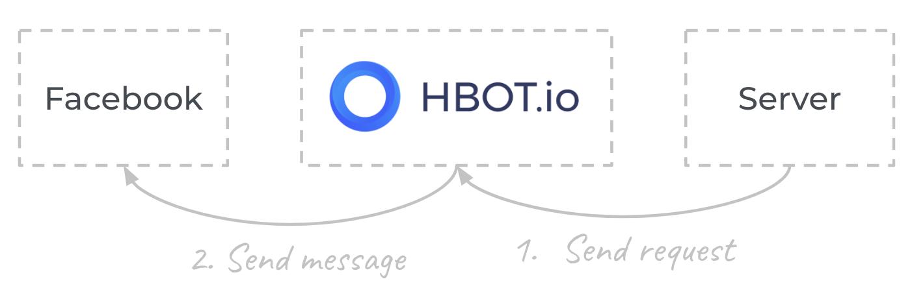

# Broadcast API

## Quick Start

Install dependencies:
```bash
$ npm install
```

Start the server:
```bash
$ BROADCAST_API_TOKEN="YOUR_BROADCAST_API"
$ npm start
```

Start the server with docker:
```bash
$ docker run \
    -it \
    --rm \
    --name nodejs-demo \
    -v `pwd`:/usr/src/app \
    -w /usr/src/app \
    -p 3000:3000 \
    -e BROADCAST_API_TOKEN="YOUR_BROADCAST_API" \
    node:alpine \
    sh -c "npm install; npm start"
```

## Usage



|              |                                   |
| ------------ | --------------------------------- |
| path         | https://hbotconnect.unicornonzen.com/api/sendmessage?accessToken=`[Broadcast API TOKEN]`        |
| method       | POST                               |
| content-type | application/json                   |

---

## Request body

```json
{
	"to": [
		USER_ID_1,
		USER_ID_2
	],
	"msg_type": "text",
	"msg": "This is a message",
	"buttons": [],
	"quick_reply" : []
 }
```

---
## Supported Node Type
- Text
- Image
- Audio
- Video
- File
- Carousel
- Set Attributes

---

### Text

```json
{
    "to": [
        USER_ID_1,
        USER_ID_2
    ],
    "msg_type": "text",
    "msg": "This is a message",
    "buttons": [],
    "quick_reply" : []
}
```
---

### Image
```json
{
    "to": [
        USER_ID_1,
        USER_ID_2
    ],
    "msg_type": "image",
    "msg": "https://www.example.com/xxx/yyy/zzz.png",
    "quick_reply" : []
}
```
---

### Audio
```json
{
    "to": [
        USER_ID_1,
        USER_ID_2
    ],
    "msg_type": "audio",
    "msg": "https://www.example.com/xxx/yyy/zzz.mp3",
    "quick_reply" : []
}
```
---

### Video
```json
{
    "to": [
        USER_ID_1,
        USER_ID_2
    ],
    "msg_type": "video",
    "msg": "https://www.example.com/xxx/yyy/zzz.mp4",
    "quick_reply" : []
}
```
---

### File
```json
{
    "to": [
        USER_ID_1,
        USER_ID_2
    ],
    "msg_type": "file",
    "msg": "https://www.example.com/xxx/yyy/zzz.pdf",
    "quick_reply" : []
}
```
---

### Carousel
```json
{
    "to": [
        USER_ID_1,
        USER_ID_2
    ],
    "msg_type": "carousel",
    "msg":[{
        "title": "Title",
        "subtitle": "Subtitle",
        "image_url": "https://www.example.com/xxx/yyy/zzz.png",
        "buttons": [{
            "title": "Open website",
            "type": "web_url",
            "url": "https://www.example.com",
            "webview_height_ratio": "tall"
        }, {
            "title": "Go to block",
            "type": "show_block",
            "block_ids": ["BLOCK_A_ID", "BLOCK_B_ID"]
        },
        ]
    },
    ],
}
```

**Note:** Max carousel number is 11.

---


### Set Attributes
```json
{
  "to": [
    USER_ID_1,
    USER_ID_2
  ],
  "msg_type": "set_attr",
  "msg": [{
        "attr_name": "ชื่อ Attribute",
        "attr_value": "ค่าที่จะเก็บ"
    }
  ]
}
```

---

#### Button
Button has 2 types - `web_url` and `show_block` which specify on `type` attribute

**Web url**

```json
"buttons":  [{
    "title": "Open website",
    "type": "web_url",
    "url": "https://www.example.com",
    "webview_height_ratio": "tall"
}]
```

*NOTE:* `webview_height_ratio` can be `tall`, `full`, and `compact`

*NOTE 2:* Max buttons number is 3.

**Show Block**

```json
"buttons":  [{
    "title": "Go to block",
    "type": "show_block",
    "block_ids": [BLOCK_A_ID, BLOCK_B_ID]
}]
```