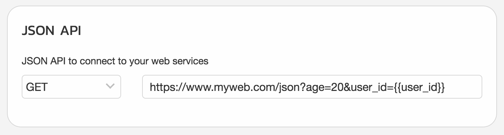

# JSON API

## Quick Start

Install dependencies:
```bash
$ npm install
```

Start the server:
```bash
$ BROADCAST_API_TOKEN="YOUR_BROADCAST_API"
$ npm start
```

Start the server with docker:
```bash
$ docker run \
    -it \
    --rm \
    --name nodejs-demo \
    -v `pwd`:/usr/src/app \
    -w /usr/src/app \
    -p 3000:3000 \
    -e BROADCAST_API_TOKEN="YOUR_BROADCAST_API" \
    node:alpine \
    sh -c "npm install; npm start"
```

## Usage

1. Register your website in JSON node on HBOT website
2. HBOT will send you a request
3. Response with message you want.


### For JSON[GET] incoming request



|              |                                   |
| ------------ | --------------------------------- |
| path         | http://localhost:3000/json        |
| method       | GET                               |
| content-type | application/x-www-form-urlencoded |
| query params | ?age=20&user_id=USER_xxxx         |


### For JSON[POST] incoming request


|              |                                        |
| ------------ | -------------------------------------- |
| path         | http://localhost:3000/json             |
| method       | POST                                   |
| content-type | application/json                       |
| body         | { "age": 20, "user_id": "USER_xxxx" }  |


## Response body

```json
{
	"nodes" : [
		NODE_1,
		NODE_2
	]
}
```

---
## Supported Node Type
- Text
- Image
- Audio
- Video
- File
- Carousel
- Set Attributes
- Go To Block

---

### Text

```json
{
	"node_type":"node",
	"nodeResponse": {
		"type": "text",
		"response": "This is message"
	}
}
```
---

### Image
```json
{
	"node_type":"node",
	"nodeResponse": {
		"type": "image",
		"response": "https://www.example.com/xxx/yyy/zzz.png"
	}
}
```
---

### Audio
```json
{
  "node_type": "node",
  "nodeResponse": {
    "type": "audio",
    "response": "https://www.example.com/xxx/yyy/zzz.mp3"
  }
}
```
---

### Video
```json
{
  "node_type": "node",
  "nodeResponse": {
    "type": "video",
    "response": "https://www.example.com/xxx/yyy/zzz.mp4"
  }
}
```
---

### File
```json
{
  "node_type": "node",
  "nodeResponse": {
    "type": "file",
    "response": "https://www.example.com/xxx/yyy/zzz.pdf"
  }
}
```
---

### Carousel
```json
{
  "node_type": "carousel",
  "image_aspect_ratio": "horizontal",
  "nodeResponse": {
    "type": "carousel",
    "response": [{
        "title": "Title",
        "subtitle": "Subtitle",
        "image_url": "https://www.example.com/xxx/yyy/zzz.png",
        "buttons": [{
            "title": "buttonA",
            "type": "web_url",
            "url": "https://www.example.com",
            "webview_height_ratio": "tall" 
          }, {
            "title": "buttonB",
            "type": "show_block",
            "block_ids": ["BLOCK_A_ID", "BLOCK_B_ID"]
          }
        ]
      }
    ]
  }
}
```

| Field 								| Description 
|-----------------------|-----------------
| `image_aspect_ratio`	| Can be `horizontal` or `square`

**Note:** Max carousel number is 11, Max button number for each carousel is 3.


---


### Set Attributes
```json
{
  "node_type": "set_attr",
  "todo": [{
    "attr_name": "ชื่อ Attribute",
		"attr_value": "ค่าที่จะเก็บ"
  }]
}
```

---


### Go To Block
```json
{
  "node_type": "gotoblock",
  "directions": [{
    "conditions": [{
        "condition": "and",
        "first_val": "{{first_name}}",
        "operation": "=",
        "second_val": "xxxxx"
      }
    ],
    "goto": ["BLOCK_A_ID", "BLOCK_B_ID"]
  }]
}
```

| Field 			| Description 
|-------------|-----------------
| `condition`	| Can be `and` or `or`
| `first_val` | If use `{{attribute}}` it will be replace with user attribute
| `operation`	| Can be "=", "!=", ">", "<", ">=" or "<="

---

#### Button
Button has 2 types - `web_url` and `show_block` which specify on `type` attribute

**Web url**
```json
"buttons":  [
	{
    "title": "buttonA",
    "type": "web_url",
    "url": "https://www.example.com",
    "webview_height_ratio": "tall"
  }
]
```

*NOTE:* `webview_height_ratio` can be `tall`, `full`, and `compact`

*NOTE 2:* Max buttons number is 3.

**Show Block**
```json
"buttons":  [
	{
    "title": "buttonB",
    "type": "show_block",
    "block_ids": ["BLOCK_A_ID", "BLOCK_B_ID"]
  }
]
```
